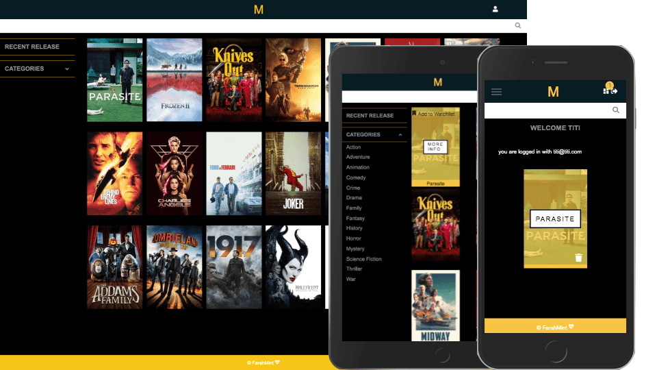

   

 Movies recommendation displays users research and allows users to select and save  movies they are interested in. 

- React.js
- React Context API 
- React-router
- MovieDB API
- Firebase 

  

