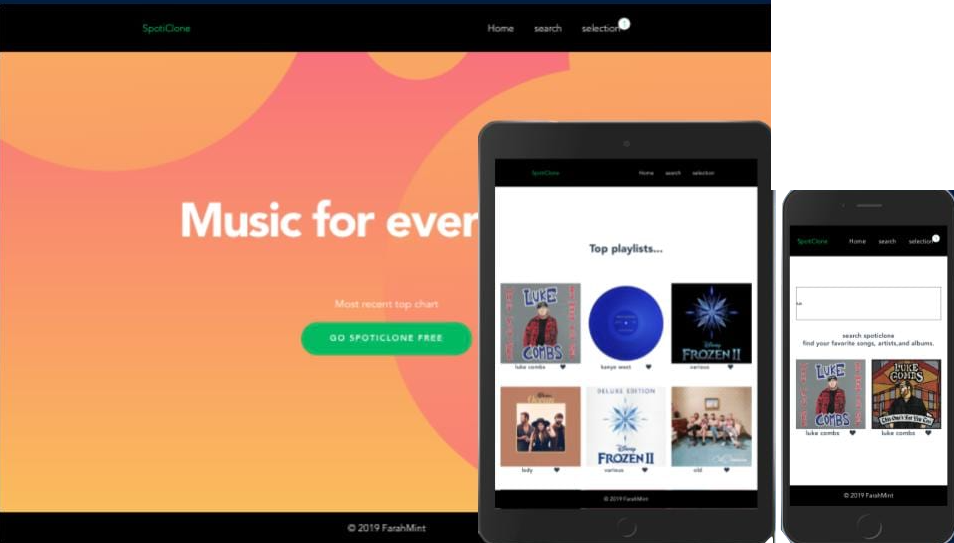

Music recommendation web app fetches data from iTunes API with search and filtering functionalities and allows users to select and save albums they like. 

- Vue.Js
- Vuex
- iTunes Api
- LocalStorage API
  

